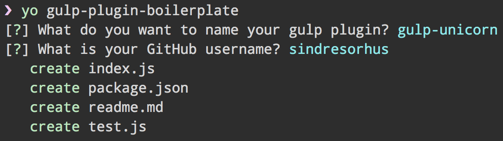

# generator-gulp-plugin-boilerplate

> Scaffold out a [Gulp plugin boilerplate](https://github.com/sindresorhus/gulp-plugin-boilerplate)




## Install

```
$ npm install --global yo generator-gulp-plugin-boilerplate
```


## Usage

Run it with [`yo`](https://github.com/yeoman/yo):

```
$ yo gulp-plugin-boilerplate
```


## License

MIT © [Sindre Sorhus](https://sindresorhus.com)
